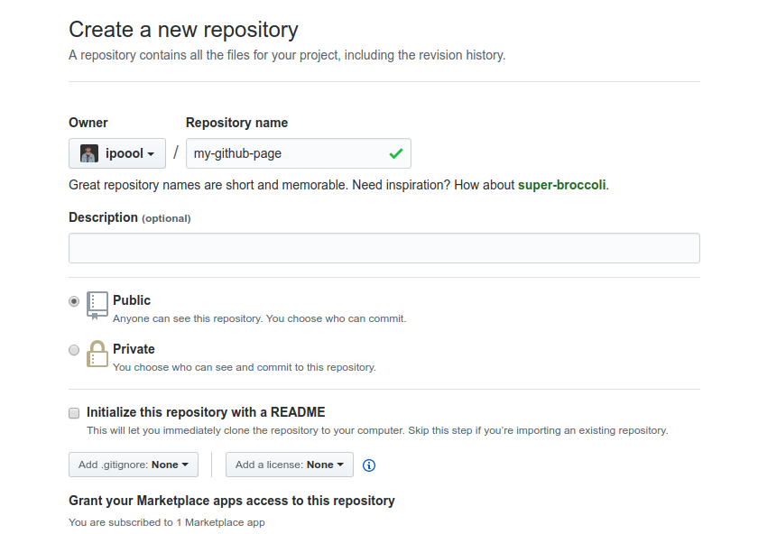
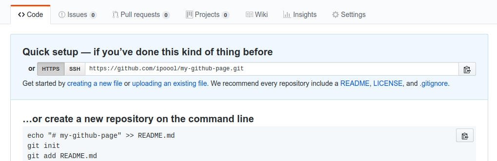
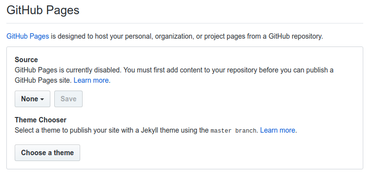
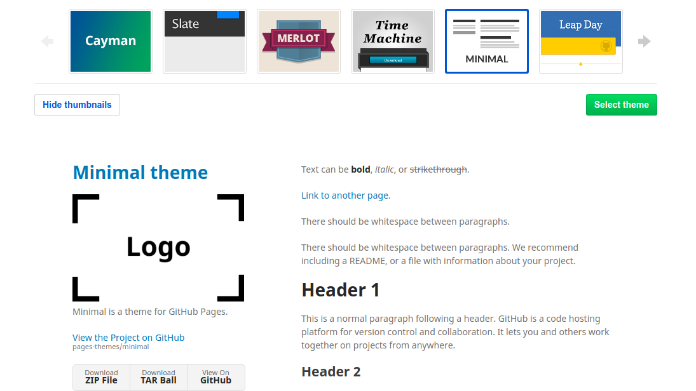
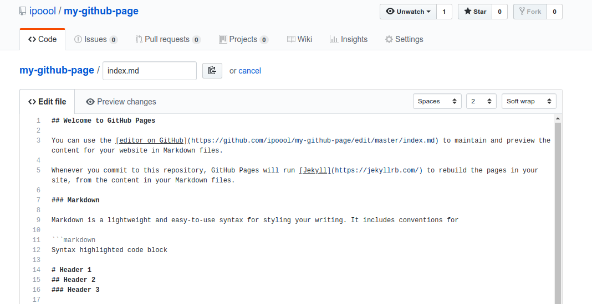
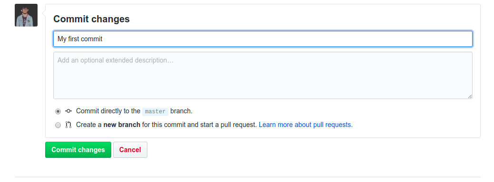
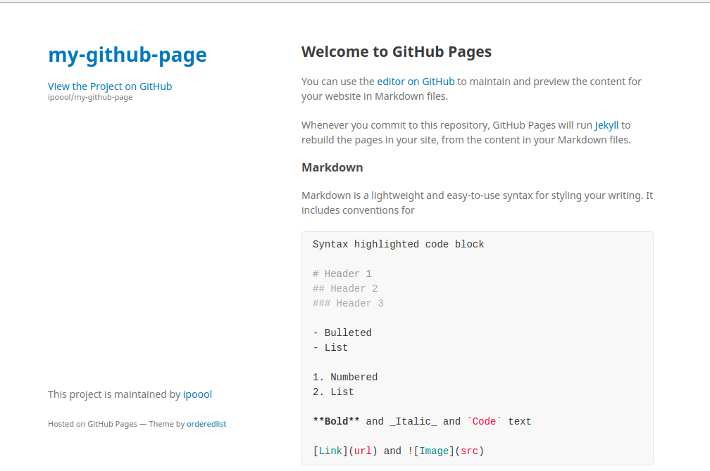

Hari ini gue mau *share* sedikit tentang cara membuat Github Pages

Untuk yang mau tau apa itu Github Pages, Silakan baca [disini](https://help.github.com/articles/what-is-github-pages/ "What is Github Pages").

Oke, kita langsung aja :

Buat temen-temen yang belum memiliki akun Github. Silakan *register* terlebih dahulu [disini](https://github.com/join?source=login "Register Github Account"), tetapi jika temen-temen sudah punya. Kita bisa lanjut ke tahap selanjutnya.

Temen-temen bisa membuat *Repository* baru untuk menyimpan *file-file static* yang akan di generate pada github pages nanti. 

Disini gue buat *repository* dengan nama "my-github-page", setelah itu kita *submit*

Setelah *repository* berhasil dibuat, selanjutnya kita pilih Menu *Setting*

Cari bagian "Github Pages" pada menu *Setting*, pilih menu *Theme* untuk memilih desain yang kita inginkan

Pilih *Theme* yang lu inginkan, Lalu tekan "Select Theme", Setelah itu kita akan diarahkan ke halaman editor untuk merubah isi dari halaman utama.

Disini lu bisa edit halaman utama dari github pages lu. Gunakan Markdown untuk seluruh halaman di Github Pages.
Jika lu belum terbiasa dengan Markdown, Silakan ke [halaman ini](https://help.github.com/articles/what-is-github-pages/ "Markdown Cheatsheet") untuk tutorial Markdown.

Nah, untuk setiap perubahan, kita harus commit perubahan tersebut

Nah, kita sudah selesai membuat sebuah halaman *static* pada Github Page. Sekarang kita hanya tinggal membuka halaman tersebut dengan cara:

*nama-akun-github-lu.github.io/nama-repository*

Sebagai contoh hasil dari Tutorial diatas seperti [disini](https://ipoool.github.io/my-github-page)